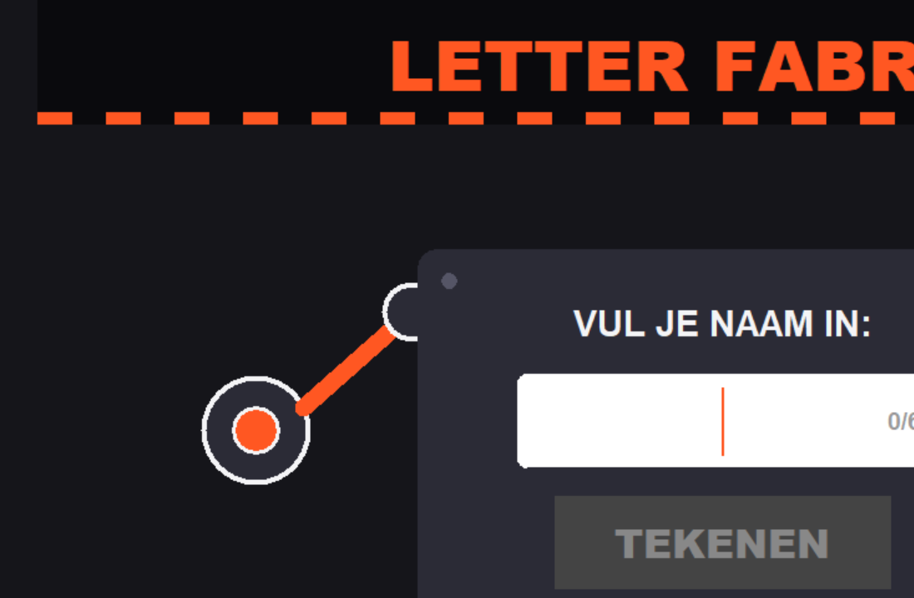

# ABB Robot Letter Fabriek

Een interactief robotproject waarbij een gebruiker een naam invoert via een Python-interface. De naam wordt via FTP naar een ABB IRC5-controller gestuurd, waarna de robot de tekst kan verwerken en tekenen/schrijven op een whiteboard.

## Projectdoel

Het doel van dit project is om een ABB-robotarm te gebruiken als demonstratie-opstelling voor een opendeurdag of technische presentatie. Bezoekers kunnen hun naam invoeren en de robot schrijft deze naam op een whiteboard.

## Belangrijkste onderdelen

- Python GUI voor invoer van namen.
- FTP-communicatie naar de ABB-robotcontroller.
- RAPID-programma's voor robotbewegingen en verwerking.
- 3D-geprinte stifthouder voor een whiteboardmarker.
- Verslag en PowerPoint-presentatie voor documentatie.

## Repositorystructuur

```text
ABB-Robot-Letter-Fabriek/
├── documentatie/
│   ├── afbeeldingen/    # Screenshots en afbeeldingen
│   ├── verslag/         # Eindverslag als PDF
│   ├── presentatie/     # PowerPoint-presentatie
│   ├── conceptkeuze/    # Ideeen en gekozen concept
│   └── project_dossier.md
├── hardware_ontwerp/
│   ├── 3d_modellen/     # STL- en SolidWorks-bestanden
│   └── stifthouder_ontwerp.md
├── programmatuur/       # Python scripts en GUI
├── robotcode/           # ABB RAPID robotprogramma's
└── voorbeelden/         # Voorbeeldbestanden zoals G-code/jobs
```

## Documentatie

- Eindverslag: `documentatie/verslag/ABB_Robot_Letter_Fabriek_verslag_final.pdf`
- Presentatie: `documentatie/presentatie/ABB_Robot_Letter_Fabriek_presentatie.pptx`
- Technisch dossier: `documentatie/project_dossier.md`
- Robotcode op de robot zetten: `documentatie/robotcode_op_robot_zetten.md`
- Conceptkeuze en ideeen: `documentatie/conceptkeuze/concept_keuze.md`
- Screenshot Python-scherm: `documentatie/afbeeldingen/python_scherm.png`
- Stifthouder: `hardware_ontwerp/stifthouder_ontwerp.md`

## Python-scherm



## Kostprijsberekening

| Onderdeel | Kostprijs |
| --- | ---: |
| ABB IRB 2400 met IRC5-controller | €10.700 |
| Raspberry Pi 3B+ + touchscreen | €44 |
| Plexiglas | €13 |
| Houten constructie | €15 |
| **Totaal** | **€10.772** |

## Benodigdheden

- ABB-robot met IRC5-controller.
- Laptop of Raspberry Pi met Python 3.
- Ethernetverbinding met de robotcontroller.
- FTP-toegang tot de robotcontroller.
- Whiteboardmarker en stifthouder.

## Netwerkinstellingen

De gebruikte testopstelling werkt met vaste IP-adressen:

- Robot: `192.168.125.1`
- PC/Raspberry Pi: `192.168.125.247`
- Subnetmasker: `255.255.255.0`

## Gebruik

1. Verbind de PC of Raspberry Pi met de ABB-controller via Ethernet.
2. Controleer de IP-instellingen.
3. Start de Python GUI:

```bash
python programmatuur/letter_fabriek_robot.py
```

4. Typ een naam in de interface.
5. De software uploadt `naam.doc` naar de robot via FTP.
6. Het RAPID-programma op de robot leest het bestand en voert de opdracht uit.

## RAPID-code op de robot zetten

De bestanden in `robotcode/` zijn robotprogramma's voor ABB RAPID. Deze moeten eerst op de robotcontroller gezet worden voordat de Python-interface iets nuttigs kan aansturen.

Korte werkwijze:

1. Zet de robot in een veilige testopstelling en controleer de noodstop.
2. Verbind de laptop met de ABB IRC5-controller via Ethernet.
3. Open RobotStudio of de FlexPendant.
4. Kopieer het gewenste `.mod`-bestand naar de controller, bijvoorbeeld naar `HOME:`.
5. Laad de module in de actieve task, meestal `T_ROB1`.
6. Controleer TCP, workobject, snelheden en zones.
7. Test eerst stap voor stap in manual mode met lage snelheid.

Een uitgebreidere uitleg staat in `documentatie/robotcode_op_robot_zetten.md`.

## Communicatieprincipe

Omdat de gebruikte ABB-controller geen PC Interface-licentie heeft, wordt er geen live socketverbinding gebruikt. In plaats daarvan werkt het systeem met een eenvoudige FTP-brievenbus:

1. De PC maakt een tekstbestand met de ingevoerde naam.
2. De PC uploadt dit bestand via FTP naar de robotcontroller.
3. De robot controleert of het bestand bestaat.
4. De robot leest de inhoud en verwijdert daarna het bestand.

## Status

Het project bevat werkende testbestanden, documentatie, robotprogramma's en software voor de demonstratie-opstelling. Voor gebruik op een echte robot moeten de TCP, werkobjecten, snelheden en veiligheidszones altijd opnieuw gecontroleerd worden.

## Opmerking over Alien en G-code

De Alien-bestanden en G-code in `voorbeelden/` zijn experimentele voorbeeldbestanden. Ze horen niet bij het bewezen werkende onderdeel van het projectverslag. Het werkende onderdeel is de naam-invoer via Python, FTP-upload naar de robot en verwerking door RAPID.
